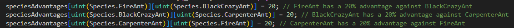
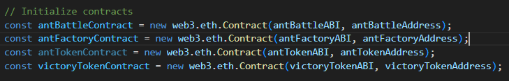
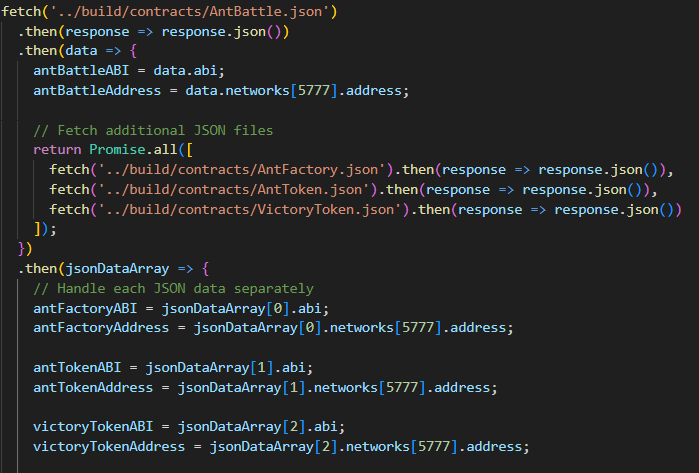

# Ant Battler Contracts

## Dependencies

- Web3.js (version 1.5.2): JavaScript library for interacting with the Ethereum blockchain.
- Solidity (version ^0.8.0): Smart contract programming language.

## Setup

- To setup this project you need ganache, truffle and python http server.

1. Deleted Build folder if there is one.
2. Open ganache, quickstart and add the truffle config file in the settings.
3. Run truffle migrate.
4. Copy an account address and paste it in the userAddress let in App.js (at the top of the file).
5. Run python -m http.server 8000 (or any other post). 

## Overview

This project consists of three Solidity contracts:

1. **AntFactory.sol**: This contract makes it possible to ctreate and manage ants.

2. **AntBattle.sol**: This contract extends from the Antfactory and makes it possible for ant tokens to battle against each other

3. **AntToken.sol**: This contract extends from the AntBattle and adds ERC-721 token functionality it makes it possible to manage the ants easier and has room for expansion (like the commented methods) to transfer ants with other people

4. **VictoryToken.sol**: This contract creates a Victory token which can be traded in for ants.

## AntFactory.sol

### Main Functions

- `createRandomAnt(string memory _name)`: Generates a new ant with a random DNA and species. it does this by making use of the `_generateRandomDna(string memory _str)` method and `_generateRandomSpecies()` method. An ant can only be created here if the user does not have an ant yet (with other words; the first one is free).
- `buyAntByChoice(string memory _name, Species _species)`: Allows users to buy ants of a specific species by choice for the cost of 3 victory tokens (sadly i had to comment this code out because it didnt work in web3) the method still makes use of the `_generateRandomDna(string memory _str)` method but the difference is that it now requires a Species. An ant can only be bought if the user already has one.
- `getAntId(uint _dna)`: Retrieves the ID of an ant based on its DNA by using the predefigned mapping `mapping (uint => uint) public dnaToId;`
- `getAntOwner(uint _antId)`: Retrieves the owner of a specific ant by using the predefigned mapping `mapping (uint => address) public antToOwner;`
- `getAntsByOwner(address _owner)`: Retrieves all ants owned by a specific address.

## AntBattle.sol

### Main Functions

- `attack(uint _antDna, uint _targetDna)`: This method is made for the battling of 2 ants, these to ants have a specific species which make them have an advantage over other ants.  It is always possible for any ant to win but the species advantage will make it more likely to win.
- `randMod(uint _modulus)`: Generates a random number within a specified modulus to determine the winner of the battle.

## AntToken.sol

### Main Functions

- `balanceOf(address _owner)`: Retrieves the number of ants owned by a specific address.
- `ownerOf(uint256 _tokenId)`: Retrieves the owner of a specific ant.
- This method has a lot of commented methods, which can still be used for later expansion.

## VictoryToken.sol

### Main Functions

- `_mintVictoryTokens(address _to, uint256 _value)`: Mints VictoryTokens and assigns them to a specified address.
- `transfer(address _to, uint256 _value)`: Allows the user to transfer VictoryTokens to a different address.
- `getTokenCount(address _owner)`: Gets all of the tokens from a given address.

## Ownable.sol

-This contract is copied from cryptozombies.

# Web3JS

## App.js/index.html

## Features

1. **Create New Ant**: Users can use the Create new ant method for their first time (or when all of the and died) to create a new ant for free.

2. **Buy New Ant**: Users can buy a new ant for 3 VictoryTokens (sadly this part doesn't work on web3 so in reality it is free) with a species of treir own choise.

3. **Battle with Ants**: Users can select which ants they want to battle with and against who. At the end of this battle the winner will receive a victoryToken.

4. **View Ants**: It is possible to view all ants and their stats, this is split up in two parts: your own, and the rest.

5. **Victory Token Counter**: There is a counter that will display how many victoryTokens you have at the moment. (there is a mintVictoryTokens method commented which will add 3 tokens to the users account to see that the counter acually works)

## Web3 Integration

The project uses Web3.js to connect to ganache.

This is how the contracts are initialized, the usage can be read in the previous parts of the readme.

To fetch the ABI's and Addresses from the contracts i made use of the fetch in js and fetched everything from the build files. From these build files it is easy to filter for the ABI's and Addresses.
